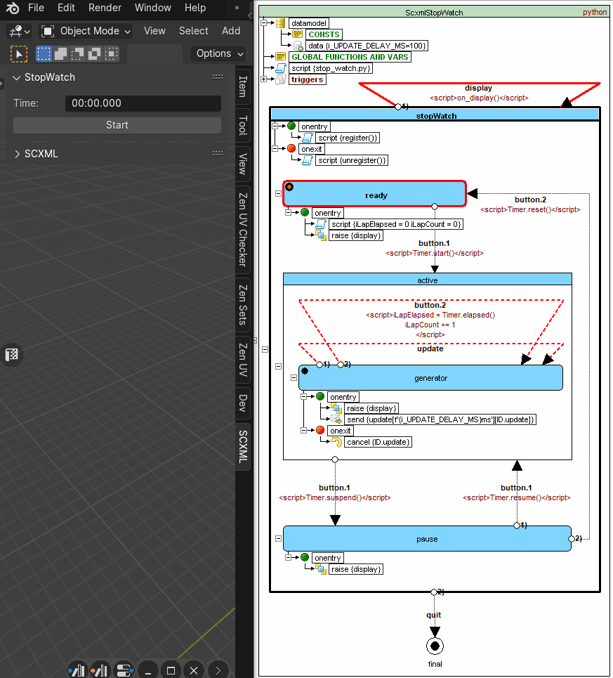

# PyBlendSCXML 1.0.0

PyBlendSCXML is designed to use SCXML state machines in Blender Python API only. It is based on [PySCXML framework (pronounced _pixel_)](https://github.com/jroxendal/PySCXML) that supplies an SCXML parser and interpreter for the Python programming language.

> [!WARNING]
> This parser will work only in Blender!

## SCXML Compliance
### Supported Data Models
PyBlendSCXML supports the following data models:
* Null Data Model, as described in [SCXML Specification - B.1 The Null Data Model](https://www.w3.org/TR/scxml/#minimal-profile)
* Python Data Model, the similar approach as described in [SCXML Specification - B.2 The ECMAScript Data Model](https://www.w3.org/TR/scxml/#ecma-profile)

### Supported Elements and Attributes
* Event data (_event.data) is implemented as a [dotsi.Dict](https://github.com/polydojo/dotsi)
* The (optional) [basic http event I/O processor](https://www.w3.org/TR/scxml/#BasicHTTPEventProcessor) is not supported
* The only service that can be instantiated with [\<invoke\>](https://www.w3.org/TR/scxml/#invoke) is another SCXML state machine

### [SCXML W3C Tests](https://www.w3.org/Voice/2013/scxml-irp/)
| Framework | Datamodel | W3C Mandatory | W3C Optional | Compliance |
|---|---|---|---|---|
| [PyBlendSCXML 1.0.0](https://github.com/alexzhornyak/PyBlendSCXML) | python | [159 of 159](https://alexzhornyak.github.io/SCXML-tutorial/Tests/python/W3C/Mandatory/Auto/report_PyBlendSCXML_1_0__Blender_4_1__Win10.html) | [22 of 33](https://alexzhornyak.github.io/SCXML-tutorial/Tests/python/W3C/Optional/Auto/report_PyBlendSCXML_1_0__Blender_4_1__Win10.html) | Partial |

## Examples

### [StopWatch](examples/StopWatch/README.md)
Allows you to record the elapsed time
|  |
|---|
| |
